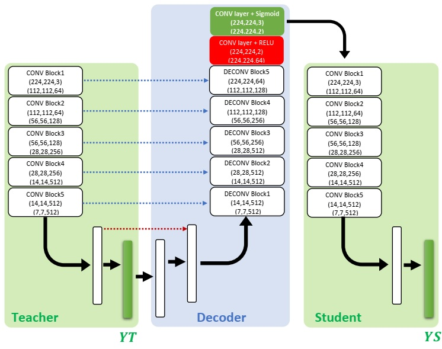
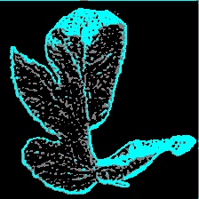

# DEEP INTERPRETABLE ARCHITECTURE FOR PLANT DISEASES CLASSIFICATION
---
This is the source code of Student/Teacher architecture described in the paper : [DEEP INTERPRETABLE ARCHITECTURE FOR PLANT DISEASES
CLASSIFICATION](https://arxiv.org/pdf/1905.13523.pdf).

We propose a new trainable visualization method for plant diseases classification based on a Convolutional Neural Network (CNN) architecture composed of two deep classifiers. The first one is named Teacher and the second one Student. This architecture leverages the multitask learning to train the Teacher and the Student jointly. Then, the communicated representation between the Teacher and the Student is used as a proxy to visualize the most important image regions for classification. This new architecture produces sharper visualization than the existing methods in plant diseases context. All experiments are achieved on PlantVillage dataset that contains 54306 plant images.

The data set used for this paper can be downloaded from [Data set](https://github.com/spMohanty/PlantVillage-Dataset/tree/master/raw/segmented). In this paper, we have used the segmented version with black background of [PlantVilage dataset](https://github.com/spMohanty/PlantVillage-Dataset).   

## Teacher/Student architectur


More details about this architecture are given in the paper:  [DEEP INTERPRETABLE ARCHITECTURE FOR PLANT DISEASES
CLASSIFICATION](https://arxiv.org/pdf/1905.13523.pdf).

## Prerequisites
To run the code, the following packages are required :

* tensorflow==1.9.0
* Keras==2.2.4
* matplotlib==3.0.2
* OpenCV 3.0
* Pillow==5.4.1


## Usage
1. install required packages.
2.Download the model uding this link  [Teacher/Student model](http://download1500.mediafire.com/0liaaipyqiqg/3494uuen1714dqy/black_models_15epochs_weights.h5).
3. Copy the model in ./model.
4. Copy input images with **black background** in ./images.
5. Run the following code from the project folder:

```bash
python visualization.py
```
The code also can be used in interactive environment using **test_visualization.ipynb**.


## Teacher/Student Visualization Example


*Original image*




*Visualization (Reconstructed image + Processed Heatmap)*

---
NOTE: When using (any part) of this repository, please cite [DEEP INTERPRETABLE ARCHITECTURE FOR PLANT DISEASES
CLASSIFICATION](https://arxiv.org/pdf/1905.13523.pdf):

```
@ARTICLE{Brahimi2019,
  author = {Brahimi, Mohammed and Mahmoudi, Said and Boukhalfa, Kamel and Moussaoui, Abdelouhab},
  title = "{Deep interpretable architecture for plant diseases classification}",
  journal = {arXiv e-prints},
  year = "2019",
  month = "May",
  url = "https://arxiv.org/abs/1905.13523"
}
```


